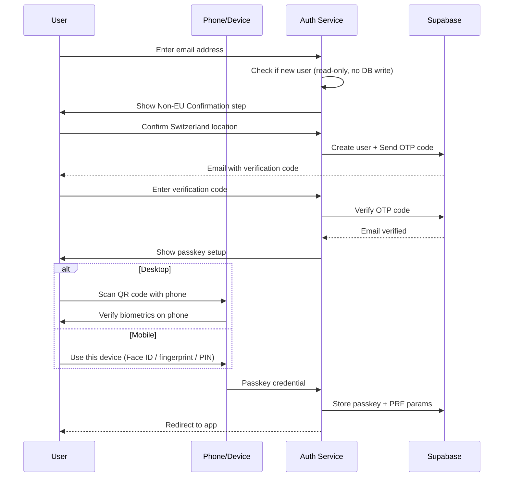
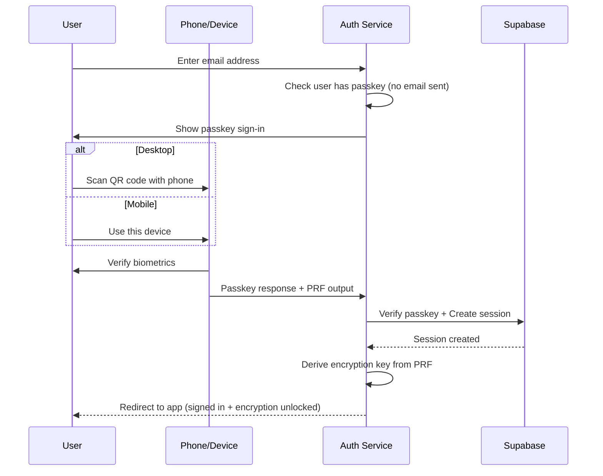

# Helvety Auth


Centralized authentication service for the Helvety ecosystem, providing passwordless SSO across all Helvety applications. Engineered & Designed in Switzerland.

> **Part of the [Helvety monorepo](https://github.com/CasparRubin/helvety).** This app lives in `apps/auth/`. See the root README for monorepo setup instructions.

## Service Availability

Helvety services are intended exclusively for customers located in Switzerland. **We are not able to serve customers in the EU/EEA.**

As a Swiss company, Helvety operates solely under the Swiss Federal Act on Data Protection (nDSG). Because we do not target or serve customers in the EU/EEA, the GDPR does not apply. For this reason, new users are asked to confirm during account creation on [helvety.com/auth](https://helvety.com/auth) that they are located in Switzerland before any personal data is stored.

## Overview

Helvety Auth (`helvety.com/auth`) handles all authentication for Helvety applications:

- **helvety.com** - Main website
- **helvety.com/store** - Store application
- **helvety.com/pdf** - PDF application
- **helvety.com/tasks** - Tasks application
- **helvety.com/contacts** - Contacts application

## Features

- **Email + Passkey Authentication** - OTP verification codes for new users (and existing without passkey); existing users with a passkey go straight to passkey sign-in
- **WebAuthn/FIDO2** - Device-aware passkey auth: on mobile, use this device (Face ID/fingerprint/PIN); on desktop, use phone via QR code + biometrics
- **Session Sharing** - Single sign-on across all Helvety apps
- **Redirect URI Support** - Cross-app authentication flows

## Environment Variables

Copy `env.template` to `.env.local` and fill in values. All `NEXT_PUBLIC_*` vars are exposed to the client; others are server-only.

| Variable                               | Required | Server-only | Description                                   |
| -------------------------------------- | -------- | ----------- | --------------------------------------------- |
| `NEXT_PUBLIC_SUPABASE_URL`             | Yes      | No          | Supabase project URL                          |
| `NEXT_PUBLIC_SUPABASE_PUBLISHABLE_KEY` | Yes      | No          | Anon key (RLS applies)                        |
| `SUPABASE_SECRET_KEY`                  | Yes      | **Yes**     | Service role key; bypasses RLS. Never expose. |
| `UPSTASH_REDIS_REST_URL`               | Prod     | **Yes**     | Redis URL for rate limiting. Prod: required.  |
| `UPSTASH_REDIS_REST_TOKEN`             | Prod     | **Yes**     | Redis token. Prod: required.                  |

> **Note:** App URLs are derived from `NODE_ENV` in `packages/shared/src/config.ts` — no URL env vars needed. Make sure your production URL (`https://helvety.com`) is in your Supabase Redirect URLs allowlist (Supabase Dashboard > Authentication > URL Configuration > Redirect URLs).

## Tech Stack

- **Framework**: Next.js 16.1.6 (App Router)
- **Language**: TypeScript
- **Authentication**: Supabase Auth + SimpleWebAuthn
- **Styling**: Tailwind CSS 4 + shadcn/ui
- **Deployment**: Vercel

## Authentication Flows

New users must first confirm they are located in Switzerland (non-EU/EEA), then receive a verification code by email to verify their address, then complete passkey setup. Existing users with a passkey skip the email and sign in with passkey directly.

### New User Flow

**Device-aware:** On **mobile** (phone/tablet), the user creates and uses the passkey on the same device (Face ID, fingerprint, or device PIN). On **desktop**, they use their phone to scan a QR code and complete the passkey on the phone.



### Returning User Flow

Existing users with a passkey do not receive an email. After entering their email, the passkey prompt appears automatically (no button click required).

Same device logic: **mobile** = sign in on this device; **desktop** = scan QR with phone and authenticate on phone.



Note: Passkey authentication creates the session directly server-side (via `verifyOtp`) without requiring the user to navigate through an additional callback URL. This ensures reliable session creation regardless of browser PKCE support.

### Key Points

- **Email required** - Users provide an email address for authentication and account recovery
- **Verification code only for new users** - New users (and existing users without a passkey) receive an OTP code by email; existing users with a passkey sign in directly with passkey
- **Passkey security** - Biometric verification (Face ID, fingerprint, or PIN) via WebAuthn

## API Routes

### GET `/auth/callback`

Handles authentication callbacks from email verification (backwards-compatible fallback) and OAuth flows. The primary sign-in flow now uses OTP codes typed by the user, but this route is kept for in-flight links, account recovery, invite, and email change flows. After successful verification, redirects to the login page with the appropriate passkey step.

**Note:** This route is NOT used for passkey sign-in. Passkey authentication creates the session directly server-side and redirects the user to their destination without going through this callback.

**Query Parameters:**

- `code` - PKCE authorization code
- `token_hash` - Email OTP token hash
- `type` - OTP type (magiclink, signup, recovery, invite, email_change)
- `redirect_uri` - Where to redirect after authentication (validated against allowlist)

**Behavior:**

- Verifies the email token (via code exchange or OTP verification)
- Checks if user has a passkey and encryption configured
- Redirects based on user status:
  - New users or missing encryption: `/login?step=encryption-setup`
  - Returning users after email verification: `/login?step=passkey-signin`
- If no `redirect_uri` is provided, defaults to `https://helvety.com`
- **Always preserves `redirect_uri`** through the entire auth flow, including when handling hash fragment authentication (where tokens arrive as `#access_token=...` instead of query params)

### `/logout` (Client-Side Page)

Signs out the user with secure key cleanup and redirects. This is a client-side page (not a route handler) so that encryption keys can be cleared from IndexedDB before the session is destroyed.

**Flow:**

1. Clears all encryption keys from IndexedDB (master + unit keys)
2. Calls server action to sign out the Supabase session
3. Redirects to the specified destination

**Query Parameters:**

- `redirect_uri` - Where to redirect after logout (default: helvety.com)

**Example:** `/logout?redirect_uri=https://helvety.com/pdf`

## Session Management (proxy.ts)

The proxy (`proxy.ts`) handles session validation, CSRF token generation, and same-origin cookie management:

- **Session Validation & Refresh** - Uses `getClaims()` to validate the JWT locally (no Auth API call when the token is valid). The Supabase Auth API is only called when a token refresh is needed (e.g. near or past expiry). Refreshed tokens are written to cookies automatically. The call is wrapped in try/catch for resilience against transient network failures (VPN, Private Relay, mobile).
- **Session Sharing** - Sets cookies using the `COOKIE_DOMAIN` constant from `config.ts` (`.helvety.com` in production) for session sharing
- **CSRF Token Generation** - Generates a CSRF token cookie on each request if not already present. The token is read by the layout and passed to client components via `CSRFProvider`. Server Actions validate the token using timing-safe comparison.
- **Server Component Support** - Ensures server components always have access to fresh session data

The proxy runs on all routes except static assets and handles the Supabase session lifecycle automatically.

## Cross-App Authentication

Other Helvety apps redirect to helvety.com/auth for authentication:

```typescript
// In helvety.com/store or helvety.com/pdf
// Apps use @helvety/shared/auth-redirect for helper functions

// Example redirect for unauthenticated users
const currentUrl = window.location.href;
const loginUrl = `https://helvety.com/auth/login?redirect_uri=${encodeURIComponent(currentUrl)}`;
window.location.href = loginUrl;
// → https://helvety.com/auth/login?redirect_uri=https://helvety.com/store/account
```

After authentication, users are redirected back to their original app with an active session (session sharing via the `COOKIE_DOMAIN` constant, `.helvety.com` in production).

## Database Schema

The service uses two tables for storing WebAuthn credentials and encryption parameters:

### user_auth_credentials

Stores WebAuthn passkey credentials:

```sql
CREATE TABLE user_auth_credentials (
  id UUID PRIMARY KEY DEFAULT gen_random_uuid(),
  user_id UUID NOT NULL REFERENCES auth.users(id) ON DELETE CASCADE,
  credential_id TEXT NOT NULL UNIQUE,
  public_key TEXT NOT NULL,
  counter BIGINT NOT NULL DEFAULT 0,
  transports TEXT[] DEFAULT '{}',
  device_type TEXT,
  backed_up BOOLEAN DEFAULT FALSE,
  last_used_at TIMESTAMPTZ,
  created_at TIMESTAMPTZ DEFAULT NOW()
);
```

### user_passkey_params

Stores PRF extension parameters for encryption key derivation:

```sql
CREATE TABLE user_passkey_params (
  user_id UUID NOT NULL PRIMARY KEY REFERENCES auth.users(id) ON DELETE CASCADE,
  credential_id TEXT NOT NULL,
  prf_salt TEXT NOT NULL,
  version INTEGER NOT NULL DEFAULT 1,
  created_at TIMESTAMPTZ NOT NULL DEFAULT NOW()
);
```

**Note:** Each user has at most one passkey params row (keyed by `user_id`). The row can be deleted when the user removes their last passkey (via the `user_passkey_params` DELETE policy). The `prf_salt` is used during PRF evaluation to derive the encryption key. The actual encryption key is never stored. It is derived client-side during passkey authentication.

## Security Considerations

- **httpOnly Cookies** - Challenge storage uses secure httpOnly cookies
- **PKCE Flow** - Supabase uses PKCE for OAuth code exchange
- **OTP Code Expiry** - Verification codes expire after 1 hour
- **Passkey Verification** - Strict origin and RP ID validation
- **Session Cookies** - Session sharing via `COOKIE_DOMAIN` constant (`.helvety.com` in production)
- **Counter Tracking** - Prevents passkey replay attacks
- **Redirect URI Validation** - All redirect URIs are validated against a strict allowlist to prevent open redirect attacks

### Security Hardening

The auth service includes the following security hardening:

- **Rate Limiting** - Protection against brute force attacks:
  - Verification code requests: 3 per 5 minutes per email, 9 per 5 minutes per IP
  - OTP verification attempts: 5 per 5 minutes per email, 15 per 5 minutes per IP
  - Passkey authentication (generation and verification): 10 per minute per IP
  - Rate limits reset on successful authentication
- **CSRF Protection** - Token-based protection with timing-safe comparison for all state-changing Server Actions
- **Server Layout Guards** - Authentication checks in Server Components (CVE-2025-29927 compliant - auth NOT in proxy)
- **Audit Logging** - Structured logging for all authentication events:
  - Login attempts (success/failure)
  - Verification code sent/failed
  - Passkey authentication (started/success/failed)
  - Rate limit exceeded events
- **Standardized Errors** - Consistent error codes and user-friendly messages that don't leak implementation details
- **Security Headers** - Content Security Policy, HSTS, X-Frame-Options, and other security headers

### Redirect URI Validation

The auth service validates all `redirect_uri` parameters to prevent open redirect vulnerabilities. Allowed destinations (explicit allowlist — no wildcards):

- `https://helvety.com` and any path
- `https://helvety.com/auth` - Authentication service
- `https://helvety.com/store` - Store / subscription management
- `https://helvety.com/pdf` - PDF tools
- `https://helvety.com/tasks` - Task management
- `https://helvety.com/contacts` - Contact management
- `http://localhost:*` - Any port (development only, gated behind `NODE_ENV`)
- `http://127.0.0.1:*` - Any port (development only, gated behind `NODE_ENV`)

All apps share the same hostname (`helvety.com`) with path-based routing, so redirect validation in `packages/shared/src/redirect-validation.ts` already allows all paths under `helvety.com`. No changes are needed when adding a new app.

Invalid redirect URIs are rejected, and the user is redirected to `helvety.com` by default.

### End-to-End Encryption Setup (for Helvety Tasks and Helvety Contacts)

Helvety Auth handles the encryption setup flow for **Helvety Tasks** and **Helvety Contacts**, the Helvety apps that use end-to-end encryption (E2EE). Auth itself does not encrypt any of its own data.

After email verification, new users are guided through passkey creation. The flow is **device-aware**:

**Passkey Creation (Registration)**

- **On mobile (phone/tablet):** User creates a passkey on this device using Face ID, fingerprint, or device PIN.
- **On desktop:** User scans a QR code with their phone and creates the passkey on the phone (Face ID or fingerprint).
- The passkey is registered with the WebAuthn PRF extension enabled. Server stores the credential and PRF salt parameters.
- On modern browsers (Chrome 132+, released January 2025), PRF output is returned during registration. The encryption key is derived and stored in IndexedDB immediately, so the user arrives at E2EE apps with encryption already unlocked (zero extra passkey touches).
- On older browsers, EncryptionGate in E2EE apps handles a one-time fallback unlock on first visit (one additional passkey touch).
- User is redirected to their destination app with an active session (created during OTP verification).

**Key Features:**

- **Encryption Passkey** - A passkey created using the WebAuthn PRF (Pseudo-Random Function) extension
- **Key Derivation** - Encryption keys are derived client-side from the PRF output using HKDF
- **Zero-Knowledge** - The server stores only PRF parameters (salt values); encryption keys are never transmitted
- **Cross-App Passkeys** - Passkeys are registered to the `helvety.com` RP ID and work for authentication across all Helvety apps; however, E2EE is only active in Helvety Tasks and Helvety Contacts
- **Cloud Sync Recommendation** - During passkey creation, the UI recommends saving the passkey to the device's built-in password manager (Passwords on iPhone or Google Password Manager on Android). These sync automatically to iCloud or Google's cloud, so the passkey can be recovered on a new device if the original is lost or replaced. Third-party password managers that support passkey sync also work.

Browser requirements for encryption:

**Desktop:**

- Chrome 128+ or Edge 128+
- Safari 18+ on Mac
- Firefox 139+ (desktop only)

**Mobile:**

- iPhone with iOS 18+
- Android 14+ with Chrome

**Note:** Firefox for Android does not support the PRF extension.

**Legal Pages:** Privacy Policy, Terms of Service, and Impressum are hosted centrally on [helvety.com](https://helvety.com) and linked in the site footer. Services are exclusively available to customers in Switzerland and are not offered to EU/EEA residents; new users must confirm they are located in Switzerland during account creation (before any personal data is stored). Only the Swiss Federal Act on Data Protection (nDSG) applies; the GDPR does not apply. An informational cookie notice informs visitors that only essential cookies are used.

**Abuse Reporting:** Abuse reports can be submitted to [contact@helvety.com](mailto:contact@helvety.com). The Impressum on [helvety.com/impressum](https://helvety.com/impressum#abuse) includes an abuse reporting section with guidance for both users and law enforcement.

## Testing

Unit tests are written with [Vitest](https://vitest.dev/) and run in a jsdom environment with type-checking enabled.

| Script                  | Description                       |
| ----------------------- | --------------------------------- |
| `bun run test`          | Run all tests once                |
| `bun run test:watch`    | Run tests in watch mode           |
| `bun run test:coverage` | Run tests with v8 coverage report |

Test files follow the `**/*.test.{ts,tsx}` pattern and live next to the source they test.

## Developer

This application is developed and maintained by [Helvety](https://helvety.com), a Swiss company focused on security and user privacy.

Vercel Analytics and Vercel Speed Insights are used across all Helvety apps for privacy-focused, anonymous page view and performance statistics. See our [Privacy Policy](https://helvety.com/privacy) for details.

For questions or inquiries, please contact us at [contact@helvety.com](mailto:contact@helvety.com). To report abuse, contact [contact@helvety.com](mailto:contact@helvety.com).

## License & Usage

> **This is NOT open source software.**

This monorepo is public so users can inspect and verify the application's behavior and security.

**All Rights Reserved.** No license is granted for any use of this code. You may:

- View and inspect the code

You may NOT:

- Copy, use, or reuse the code in any form
- Redistribute, publish, or share the code
- Modify, adapt, or create derivative works
- Sell, sublicense, or commercially exploit the code
- Reverse engineer or decompile the code

**This is a free centralized authentication service accessible at [helvety.com/auth](https://helvety.com/auth).** No subscription is required to use the authentication service.

See [LICENSE](./LICENSE) for full legal terms.
