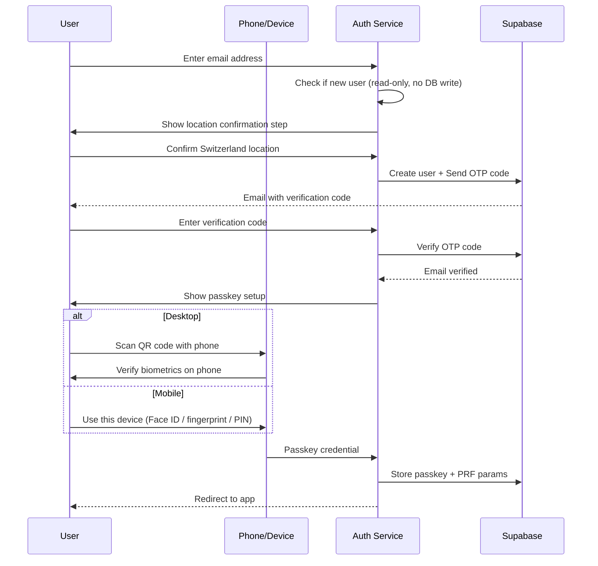
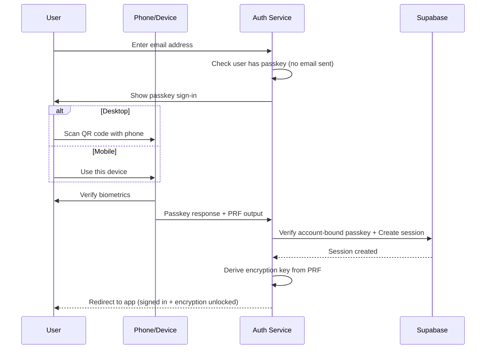

# Helvety Auth


Centralized authentication service for the Helvety ecosystem, providing passwordless SSO across all Helvety applications. Engineered & Designed in Switzerland.

> **Part of the [Helvety monorepo](https://github.com/CasparRubin/helvety).** This app lives in `apps/auth/`. See the root README for monorepo setup instructions.

## Service Availability

Helvety services are primarily intended for customers in Switzerland. New account creation includes a Switzerland location confirmation step for account-based services, but technical access from outside Switzerland may still occur. Mandatory law in other jurisdictions may still apply in specific cases.

Helvety's legal baseline is Swiss data protection law (nDSG). Account-based services ask new users to confirm Switzerland-based usage during account creation on [helvety.com/auth](https://helvety.com/auth) before a new account is created.

## Overview

Helvety Auth (`helvety.com/auth`) handles all authentication for Helvety applications:

- **helvety.com** - Main website
- **helvety.com/store** - Store application
- **helvety.com/pdf** - PDF application
- **helvety.com/tasks** - Tasks application
- **helvety.com/contacts** - Contacts application

## Features

- **Email + Passkey Authentication** - OTP verification codes for new users (and existing without passkey); existing users with a passkey go straight to passkey sign-in
- **WebAuthn/FIDO2** - Device-aware passkey auth: on mobile, use this device (Face ID/fingerprint/PIN); on desktop, use phone via QR code + biometrics
- **Session Sharing** - Single sign-on across all Helvety apps
- **Redirect URI Support** - Cross-app authentication flows

## Environment Variables

Copy `env.template` to `.env.local` and fill in values. All `NEXT_PUBLIC_*` vars are exposed to the client; others are server-only.

| Variable                               | Required | Server-only | Description                                                                            |
| -------------------------------------- | -------- | ----------- | -------------------------------------------------------------------------------------- |
| `NEXT_PUBLIC_SUPABASE_URL`             | Yes      | No          | Supabase project URL                                                                   |
| `NEXT_PUBLIC_SUPABASE_PUBLISHABLE_KEY` | Yes      | No          | Publishable key (RLS applies)                                                          |
| `SUPABASE_SECRET_KEY`                  | Yes      | **Yes**     | Service role key for server-side admin operations (bypasses RLS). Must not be exposed. |
| `UPSTASH_REDIS_REST_URL`               | Yes      | **Yes**     | Redis URL for rate limiting. Required by startup validation in all environments.       |
| `UPSTASH_REDIS_REST_TOKEN`             | Yes      | **Yes**     | Redis token for rate limiting. Required by startup validation in all environments.     |

> **Note:** App URLs are derived from `NODE_ENV` in `packages/shared/src/config.ts` — no URL env vars needed. Make sure your production URL (`https://helvety.com`) is in your Supabase Redirect URLs allowlist (Supabase Dashboard > Authentication > URL Configuration > Redirect URLs).
>
> **Auth stack note:** Helvety Auth uses Supabase Auth + passkeys (WebAuthn), not NextAuth/Auth.js. `NEXTAUTH_SECRET`/`AUTH_SECRET` are not used.

## Tech Stack

- **Framework**: Next.js 16.x (App Router)
- **Language**: TypeScript
- **Authentication**: Supabase Auth + SimpleWebAuthn
- **Styling**: Tailwind CSS 4 + shadcn/ui
- **Deployment**: Vercel

## Authentication Flows

New users must first confirm they are located in Switzerland and acknowledge that service availability may be restricted for EU/EEA users, then receive a verification code by email to verify their address, then complete passkey setup. Existing users with a passkey skip the email and sign in with passkey directly.

### New User Flow

**Device-aware:** On **mobile** (phone/tablet), the user creates and uses the passkey on the same device (Face ID, fingerprint, or device PIN). On **desktop**, they use their phone to scan a QR code and complete the passkey on the phone.


```mermaid
sequenceDiagram
    participant U as User
    participant P as Phone/Device
    participant A as Auth Service
    participant S as Supabase

    U->>A: Enter email address
    A->>A: Check if new user (read-only, no DB write)
    A->>U: Show location confirmation step
    U->>A: Confirm Switzerland location
    A->>S: Create user + Send OTP code
    S-->>U: Email with verification code
    U->>A: Enter verification code
    A->>S: Verify OTP code
    S-->>A: Email verified
    A->>U: Show passkey setup
    alt Desktop
      U->>P: Scan QR code with phone
      P->>U: Verify biometrics on phone
    else Mobile
      U->>P: Use this device (Face ID / fingerprint / PIN)
    end
    P->>A: Passkey credential
    A->>S: Store passkey + PRF params
    A-->>U: Redirect to app
```

### Returning User Flow

Existing users with a passkey do not receive an email. After entering their email, the passkey prompt appears automatically (no button click required). The passkey challenge is bound to that email's account so only passkeys registered to that account are accepted.

Same device logic: **mobile** = sign in on this device; **desktop** = scan QR with phone and authenticate on phone.


```mermaid
sequenceDiagram
    participant U as User
    participant P as Phone/Device
    participant A as Auth Service
    participant S as Supabase

    U->>A: Enter email address
    A->>A: Check user has passkey (no email sent)
    A->>U: Show passkey sign-in
    alt Desktop
      U->>P: Scan QR code with phone
    else Mobile
      U->>P: Use this device
    end
    P->>U: Verify biometrics
    P->>A: Passkey response + PRF output
    A->>S: Verify account-bound passkey + Create session
    S-->>A: Session created
    A->>A: Derive encryption key from PRF
    A-->>U: Redirect to app (signed in + encryption unlocked)
```

Note: Passkey authentication creates the session directly server-side (via `verifyOtp`) without requiring the user to navigate through an additional callback URL. This is intended to improve session creation reliability across browsers, including cases where PKCE callback handling differs.

### Key Points

- **Email required** - Users provide an email address for authentication and account recovery
- **Verification code only for new users** - New users (and existing users without a passkey) receive an OTP code by email; existing users with a passkey sign in directly with passkey
- **Passkey security** - Biometric verification (Face ID, fingerprint, or PIN) via WebAuthn
- **Account-bound sign-in** - Returning-user passkey authentication is bound to the entered email/account, preventing cross-account passkey mismatches on shared devices

## API Routes

### GET `/auth/callback`

Handles authentication callbacks from email verification (backwards-compatible fallback) and OAuth flows. The primary sign-in flow now uses OTP codes typed by the user, but this route is kept for in-flight links, account recovery, invite, and email change flows. After successful verification, redirects to the login page with the appropriate passkey step.

**Note:** This route is NOT used for passkey sign-in. Passkey authentication creates the session directly server-side and redirects the user to their destination without going through this callback.

**Query Parameters:**

- `code` - PKCE authorization code
- `token_hash` - Email OTP token hash
- `type` - OTP type (magiclink, signup, recovery, invite, email_change)
- `redirect_uri` - Where to redirect after authentication (validated against allowlist)

**Behavior:**

- Verifies the email token (via code exchange or OTP verification)
- Checks if user has a passkey and encryption configured
- Redirects based on user status:
  - New users or missing encryption: `/login?step=encryption-setup`
  - Returning users after email verification: `/login?step=passkey-signin`
- If no `redirect_uri` is provided, defaults to `https://helvety.com`
- **Designed to preserve `redirect_uri`** through the auth flow, including hash-fragment authentication handling (where tokens arrive as `#access_token=...` instead of query params)

### `/logout` (Client-Side Page)

Signs out the user with strict local cleanup and centralized re-auth entry. This is a client-side page (not a route handler) so encryption artifacts can be cleared from browser storage before the session is destroyed.

**Flow:**

1. Clears local encryption artifacts (IndexedDB keys + cached PRF salt)
2. Calls server action to sign out the Supabase session (`scope=global` when requested)
3. Always redirects to `/auth/login` with `force_login=1` and preserves the validated `redirect_uri`
4. The login flow then returns the user to `redirect_uri` after successful auth

**Query Parameters:**

- `redirect_uri` - Where to redirect after logout (default: helvety.com)
- `scope` - Optional; set to `global` to revoke all refresh tokens and force full re-authentication

**Examples:**

- `/logout?redirect_uri=https://helvety.com/pdf`
- `/logout?redirect_uri=https://helvety.com/tasks&scope=global`

## Session Management (proxy.ts)

The proxy (`proxy.ts`, via `@helvety/shared/proxy`) handles lightweight request setup and same-origin cookie management:

- **Proxy Scope** - Sets lightweight request headers/CSP and CSRF cookie bootstrap. Authentication and authorization checks are enforced in pages, Server Actions, and Route Handlers.
- **Session Sharing** - Sets cookies using the `COOKIE_DOMAIN` constant from `@helvety/shared/config` (`.helvety.com` in production) for session sharing
- **CSRF Token Generation** - Generates a CSRF token cookie on each request if not already present. The token is read by the layout and passed to client components via `CSRFProvider`. Server Actions validate the token using timing-safe comparison.
- **Server Component Support** - Helps keep server components aligned with current session state

The proxy runs on all routes except static assets and is not the primary auth enforcement boundary.

## Cross-App Authentication

Other Helvety apps redirect to helvety.com/auth for authentication:

```typescript
// In helvety.com/store or helvety.com/pdf
// Apps use @helvety/shared/auth-redirect for helper functions

// Example redirect for unauthenticated users
const currentUrl = window.location.href;
const loginUrl = `https://helvety.com/auth/login?redirect_uri=${encodeURIComponent(currentUrl)}`;
window.location.href = loginUrl;
// → https://helvety.com/auth/login?redirect_uri=https://helvety.com/store/account
```

After authentication, users are redirected back to their original app with an active session (session sharing via the `COOKIE_DOMAIN` constant, `.helvety.com` in production).

## Database Schema

The service uses two tables for storing WebAuthn credentials and encryption parameters:

### user_auth_credentials

Stores WebAuthn passkey credentials:

```sql
CREATE TABLE user_auth_credentials (
  id UUID PRIMARY KEY DEFAULT gen_random_uuid(),
  user_id UUID NOT NULL REFERENCES auth.users(id) ON DELETE CASCADE,
  credential_id TEXT NOT NULL UNIQUE,
  public_key TEXT NOT NULL,
  counter BIGINT NOT NULL DEFAULT 0,
  transports TEXT[] DEFAULT '{}',
  device_type TEXT,
  backed_up BOOLEAN DEFAULT FALSE,
  last_used_at TIMESTAMPTZ,
  created_at TIMESTAMPTZ DEFAULT NOW()
);
```

### user_passkey_params

Stores PRF extension parameters for encryption key derivation:

```sql
CREATE TABLE user_passkey_params (
  user_id UUID NOT NULL PRIMARY KEY REFERENCES auth.users(id) ON DELETE CASCADE,
  credential_id TEXT NOT NULL,
  prf_salt TEXT NOT NULL,
  version INTEGER NOT NULL DEFAULT 1,
  created_at TIMESTAMPTZ NOT NULL DEFAULT NOW()
);
```

**Note:** Each user has at most one passkey params row (keyed by `user_id`). The row can be deleted when the user removes their last passkey (via the `user_passkey_params` DELETE policy). The `prf_salt` is used during PRF evaluation to derive the encryption key. The actual encryption key is intended to remain client-side and is derived during passkey authentication.

## Security Considerations

- **httpOnly Cookies** - Challenge storage uses HttpOnly cookies (`Secure` in production)
- **PKCE Flow** - Supabase uses PKCE for OAuth code exchange
- **OTP Code Expiry** - Verification codes expire after 1 hour
- **Passkey Verification** - Strict origin and RP ID validation
- **Expected Account Binding** - Returning-user passkey verification enforces the expected account from the login email/challenge metadata
- **Session Cookies** - Session sharing via `COOKIE_DOMAIN` constant (`.helvety.com` in production)
- **Counter Tracking** - Prevents passkey replay attacks
- **Redirect URI Validation** - All redirect URIs are validated against a strict allowlist to prevent open redirect attacks

### Security Hardening

The auth service includes the following security hardening:

- **Rate Limiting** - Protection against brute force attacks:
  - Verification code requests: 3 per 5 minutes per email, 9 per 5 minutes per IP
  - OTP verification attempts: 5 per 5 minutes per email, 15 per 5 minutes per IP
  - Passkey authentication (generation and verification): 10 per minute per IP
  - Rate limits reset on successful authentication
- **CSRF Protection** - Token-based protection with timing-safe comparison for all state-changing Server Actions
- **Server-side Action/Handler Enforcement** - Authentication and security checks are enforced in Server Actions and route handlers (aligned with current Next.js security guidance; auth checks are not enforced in proxy)
- **Audit Logging** - Structured logging for all authentication events:
  - Login attempts (success/failure)
  - Verification code sent/failed
  - Passkey authentication (started/success/failed)
  - Rate limit exceeded events
- **Standardized Errors** - Consistent error codes and user-friendly messages that don't leak implementation details
- **Security Headers** - Content Security Policy, HSTS, X-Frame-Options, and other security headers

### Redirect URI Validation

The auth service validates all `redirect_uri` parameters to prevent open redirect vulnerabilities. Allowed destinations (explicit allowlist — no wildcards):

- `https://helvety.com` and any path
- `https://helvety.com/auth` - Authentication service
- `https://helvety.com/store` - Store / subscription management
- `https://helvety.com/pdf` - PDF tools
- `https://helvety.com/tasks` - Task management
- `https://helvety.com/contacts` - Contact management
- `http://localhost:*` - Any port (development only, gated behind `NODE_ENV`)
- `http://127.0.0.1:*` - Any port (development only, gated behind `NODE_ENV`)

All apps share the same hostname (`helvety.com`) with path-based routing, so redirect validation in `packages/shared/src/redirect-validation.ts` already allows all paths under `helvety.com`. In the current routing model, adding a new app path typically does not require redirect-validation changes.

Invalid redirect URIs are rejected, and the user is redirected to `helvety.com` by default.

### End-to-End Encryption Setup (for Helvety Tasks and Helvety Contacts)

Helvety Auth handles the encryption setup flow for **Helvety Tasks** and **Helvety Contacts**, the Helvety apps that use end-to-end encryption (E2EE). Auth itself does not encrypt any of its own data.

After email verification, new users are guided through passkey creation. The flow is **device-aware**:

**Passkey Creation (Registration)**

- **On mobile (phone/tablet):** User creates a passkey on this device using Face ID, fingerprint, or device PIN.
- **On desktop:** User scans a QR code with their phone and creates the passkey on the phone (Face ID or fingerprint).
- The passkey is registered with the WebAuthn PRF extension enabled. Server stores the credential and PRF salt parameters.
- In many modern browser flows, PRF output is returned during registration. When available, the encryption key is derived and stored in IndexedDB immediately, so users can arrive at E2EE apps with encryption already unlocked.
- In browser flows where PRF output is not returned during registration, users must complete one additional passkey interaction in `/auth` before returning to E2EE apps.
- User is redirected to their destination app with an active session (created during OTP verification).

**Key Features:**

- **Encryption Passkey** - A passkey created using the WebAuthn PRF (Pseudo-Random Function) extension
- **Key Derivation** - Encryption keys are derived client-side from the PRF output using HKDF
- **Zero-Knowledge-Oriented Design** - The server stores only PRF parameters (salt values); encryption keys remain client-side and are not stored by Helvety
- **Cross-App Passkeys** - Passkeys are registered to the `helvety.com` RP ID and work for authentication across all Helvety apps; however, E2EE is only active in Helvety Tasks and Helvety Contacts
- **Cloud Sync Recommendation** - During passkey creation, the UI recommends saving the passkey to the device's built-in password app (Passwords on iPhone or Google Password Manager on Android) with cloud sync enabled. If all synced passkeys are lost, encrypted content cannot be recovered by Helvety.

Browser compatibility for encryption depends on WebAuthn PRF support and can evolve over time:

**Desktop:**

- Chrome/Edge (recent versions)
- Safari on macOS (recent versions)
- Firefox desktop (recent versions)

**Mobile:**

- iPhone/iPad (recent iOS/iPadOS versions)
- Android (recent versions) with Chrome

**Note:** Firefox on Android may not support the PRF extension in current tested flows.

**Legal Pages:** Privacy Policy, Terms of Service, and Impressum are hosted centrally on [helvety.com](https://helvety.com) and linked in the site footer. Services are primarily intended for customers in Switzerland, and new users confirm Switzerland-based usage during account creation (before a new account is created). The legal baseline is Swiss data protection law (nDSG), and where other mandatory law applies in a specific case, Helvety follows those obligations. An informational cookie notice explains essential cookies and privacy-focused telemetry (Vercel Analytics and Speed Insights).

**Abuse Reporting:** Abuse reports can be submitted to [contact@helvety.com](mailto:contact@helvety.com). The Impressum on [helvety.com/impressum](https://helvety.com/impressum#abuse) includes an abuse reporting section with guidance for both users and law enforcement.

## Testing

Unit tests are written with [Vitest](https://vitest.dev/) and run in a jsdom environment with type-checking enabled.

| Script                  | Description                       |
| ----------------------- | --------------------------------- |
| `bun run test`          | Run all tests once                |
| `bun run test:watch`    | Run tests in watch mode           |
| `bun run test:coverage` | Run tests with v8 coverage report |

Test files follow the `**/*.test.{ts,tsx}` pattern and live next to the source they test.

## Developer

This application is developed and maintained by [Helvety](https://helvety.com), a Swiss company focused on security and user privacy.

Vercel Analytics and Vercel Speed Insights are used across Helvety apps for privacy-oriented, aggregated/pseudonymized page-view and performance metrics. See our [Privacy Policy](https://helvety.com/privacy) for details.

For questions or inquiries, please contact us at [contact@helvety.com](mailto:contact@helvety.com). To report abuse, contact [contact@helvety.com](mailto:contact@helvety.com).

## License & Usage

> **This is NOT open source software.**

This monorepo is public so users can inspect the code and independently assess application behavior and security posture.

**All Rights Reserved.** No license is granted for any use of this code. You may:

- View and inspect the code

You may NOT:

- Copy, use, or reuse the code in any form
- Redistribute, publish, or share the code
- Modify, adapt, or create derivative works
- Sell, sublicense, or commercially exploit the code
- Reverse engineer or decompile the code

**This is a centralized authentication service accessible at [helvety.com/auth](https://helvety.com/auth).** Access to this service may change over time as product terms evolve.

See [LICENSE](./LICENSE) for full legal terms.
