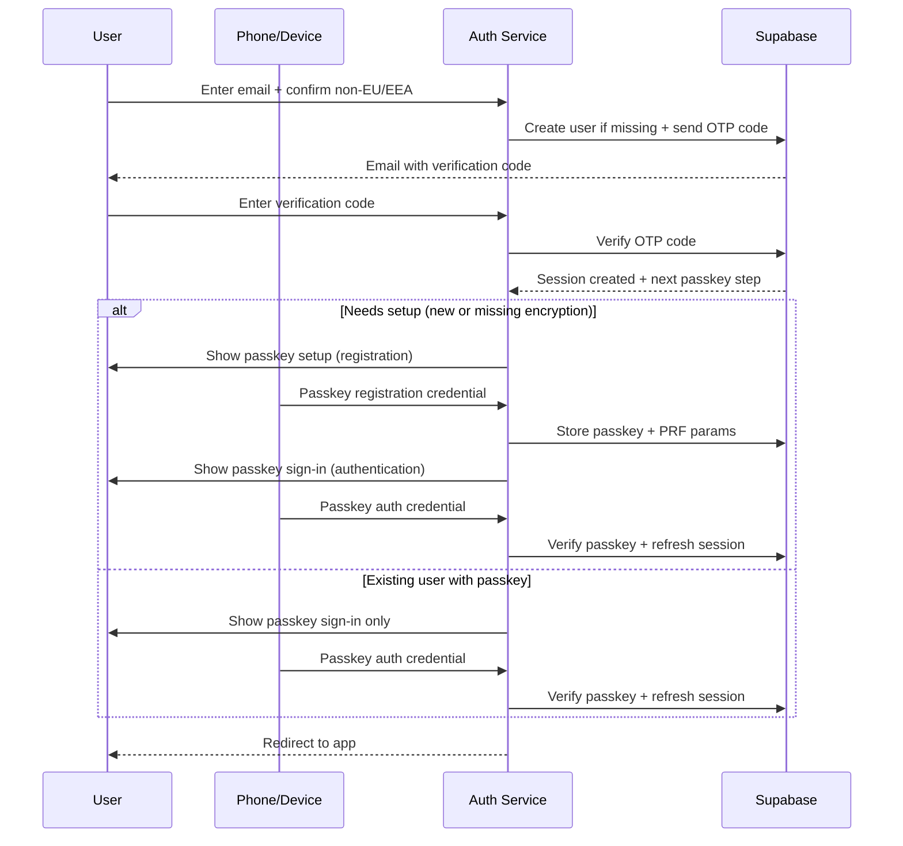

# Helvety Auth


Centralized authentication service for the Helvety ecosystem, providing passwordless SSO across all Helvety applications. Engineered & Designed in Switzerland.

> **Part of the [Helvety monorepo](https://github.com/CasparRubin/helvety).** This app lives in `apps/auth/`. See the root README for monorepo setup instructions.

## Service Availability

Helvety services are primarily intended for customers in Switzerland. During sign-in, users must confirm they are not located in the EU/EEA before the verification-code step continues. Technical access from outside Switzerland may still occur. Mandatory law in other jurisdictions may still apply in specific cases.

Helvety's legal baseline is Swiss data protection law (nDSG). Account-based services on [helvety.com/auth](https://helvety.com/auth) collect this location-attestation signal as part of the authentication flow.

## Overview

Helvety Auth (`helvety.com/auth`) handles all authentication for Helvety applications:

- **helvety.com** - Main website
- **helvety.com/store** - Store application
- **helvety.com/pdf** - PDF application
- **helvety.com/tasks** - Tasks application
- **helvety.com/contacts** - Contacts application
- **helvety.com/notes** - Notes application

## Features

- **Email + Passkey Authentication** - All users complete email verification-code authentication first, then complete the primary passkey step (setup for first-time users, sign-in for existing users)
- **WebAuthn/FIDO2** - Device-aware passkey auth: on mobile, use this device (Face ID/fingerprint/PIN); on desktop, use phone via QR code + biometrics
- **Session Sharing** - Single sign-on across all Helvety apps
- **Redirect URI Support** - Cross-app authentication flows

## Environment Variables

Copy `env.template` to `.env.local` and fill in values. All `NEXT_PUBLIC_*` vars are exposed to the client; others are server-only.

| Variable                               | Required | Server-only | Description                                                                                                                                                                                                                                        |
| -------------------------------------- | -------- | ----------- | -------------------------------------------------------------------------------------------------------------------------------------------------------------------------------------------------------------------------------------------------- |
| `NEXT_PUBLIC_SUPABASE_URL`             | Yes      | No          | Supabase project URL                                                                                                                                                                                                                               |
| `NEXT_PUBLIC_SUPABASE_PUBLISHABLE_KEY` | Yes      | No          | Publishable key (RLS applies)                                                                                                                                                                                                                      |
| `SUPABASE_SECRET_KEY`                  | Yes      | **Yes**     | Supabase secret key (recommended format: `sb_secret_...`; legacy `service_role` keys may still exist in older setups) for trusted server-side admin operations. It can bypass RLS where object privileges allow; must never be exposed to clients. |
| `UPSTASH_REDIS_REST_URL`               | Yes      | **Yes**     | Redis URL for rate limiting. Required by startup validation in all environments.                                                                                                                                                                   |
| `UPSTASH_REDIS_REST_TOKEN`             | Yes      | **Yes**     | Redis token for rate limiting. Required by startup validation in all environments.                                                                                                                                                                 |

> **Note:** App URLs are derived from `NODE_ENV` in `packages/shared/src/config.ts` — no URL env vars needed. Make sure your production URL (`https://helvety.com`) is in your Supabase Redirect URLs allowlist (Supabase Dashboard > Authentication > URL Configuration > Redirect URLs).
>
> **Auth stack note:** Helvety Auth uses Supabase Auth + passkeys (WebAuthn), not NextAuth/Auth.js. `NEXTAUTH_SECRET`/`AUTH_SECRET` are not used.

## Tech Stack

- **Framework**: Next.js 16.x (App Router)
- **Language**: TypeScript
- **Authentication**: Supabase Auth + SimpleWebAuthn
- **Styling**: Tailwind CSS 4 + shadcn/ui
- **Deployment**: Vercel

## Authentication Flows

Users first enter email and confirm they are not located in the EU/EEA. The service then sends a verification code by email (creating the user at OTP-send time when needed). The login UI uses a **four-step** stepper (Email → OTP → Passkey setup → Passkey sign-in) **before** OTP so the flow looks the same for unknown addresses. After OTP: users who already have a passkey **skip** setup and go straight to passkey **sign-in** (stepper shows three nodes: steps 1, 2, and 4). Users who need setup complete **registration** (step 3), then **authentication** (step 4) before redirect.

### Unified Auth Flow

**Device-aware:** On **mobile** (phone/tablet), the user creates and uses the passkey on the same device (Face ID, fingerprint, or device PIN). On **desktop**, they use their phone to scan a QR code and complete the passkey on the phone.


```mermaid
sequenceDiagram
    participant U as User
    participant P as Phone/Device
    participant A as Auth Service
    participant S as Supabase

    U->>A: Enter email + confirm non-EU/EEA
    A->>S: Create user if missing + send OTP code
    S-->>U: Email with verification code
    U->>A: Enter verification code
    A->>S: Verify OTP code
    S-->>A: Session created + next passkey step
    alt Needs setup (new or missing encryption)
      A->>U: Show passkey setup (registration)
      P->>A: Passkey registration credential
      A->>S: Store passkey + PRF params
      A->>U: Show passkey sign-in (authentication)
      P->>A: Passkey auth credential
      A->>S: Verify passkey + refresh session
    else Existing user with passkey
      A->>U: Show passkey sign-in only
      P->>A: Passkey auth credential
      A->>S: Verify passkey + refresh session
    end
    A-->>U: Redirect to app
```

Note: Passkey authentication creates the session directly server-side (via `verifyPasskeyAuthentication`) without requiring the user to navigate through an additional callback URL. This is intended to improve session creation reliability across browsers, including cases where PKCE callback handling differs. During returning-user login, pre-auth auth options do not include PRF bootstrap metadata; PRF bootstrap is resolved primarily from server-side PRF params, with localStorage as a resilience fallback.

### Key Points

- **Email required** - Users provide an email address for authentication and account recovery
- **Verification code for all users** - Sign-in always continues through the OTP verification step before passkey
- **Passkey security** - Biometric verification (Face ID, fingerprint, or PIN) via WebAuthn
- **Account-bound sign-in** - Returning-user passkey authentication is bound to the entered email/account, preventing cross-account passkey mismatches on shared devices
- **Resilient login bootstrap** - Initial auth restore on `/auth/login` uses timeout-bounded probing and safe fallback to manual sign-in to avoid infinite loading states when refresh tokens are expired/revoked or the Auth API is rate-limited
- **Passkey setup completion** - After successful registration, the encryption-setup UI shows a short “Passkey saved” state, then the flow continues to **passkey sign-in** (step 4); redirect happens after successful `verifyPasskeyAuthentication` (same as returning users)
- **Verification code length** - OTP values are **6–8 digits** (Supabase configuration); the login field uses `otp-code` helpers for client/server alignment
- **Session-aware `/login`** - With a valid Supabase session and both passkey and encryption configured, `/login` on the email step can **redirect** straight to `redirect_uri` or home so returning users avoid an extra passkey for **non-E2EE** apps (e.g. web home, store, PDF). Apps that use **EncryptionGate** (notes, tasks, contacts) **do not** get that shortcut: login bootstrap keeps the user on **passkey sign-in** until the browser unlocks local crypto (see `requiresE2eeBrowserUnlock` in `@helvety/shared/e2ee-app-paths`). Use `force_login=1` to always show passkey sign-in (e.g. after logout or when EncryptionGate sends users back to auth).

- **Stepper wiring (code)** - `LoginStep` → `AuthStep` / `AuthStepperMode` mapping lives in `lib/login-flow-stepper.ts` and is used by `useLoginFlow` (see `login-flow-stepper.test.ts`). Server-driven “next step after verify” for `/auth/callback` and similar uses `lib/auth-step.ts` (`resolveAuthStep`) from passkey/encryption readiness — keep these in sync when changing flows.

## API Routes

### GET `/auth/callback`

Handles authentication callbacks for compatibility and OAuth flows. The primary sign-in flow is always: email + non-EU/EEA confirmation, typed OTP code, then the primary passkey step (setup for first-time users, passkey sign-in for returning users). This callback route remains for in-flight links, account recovery, invite, and email change flows. After successful verification, it redirects to login with the required passkey step.

**Note:** This route is NOT used for passkey sign-in. Passkey authentication creates the session directly server-side and redirects the user to their destination without going through this callback.

**Query Parameters:**

- `code` - PKCE authorization code
- `token_hash` - Email OTP token hash
- `type` - OTP type (magiclink, signup, recovery, invite, email_change)
- `redirect_uri` - Where to redirect after authentication (validated against allowlist)

**Behavior:**

- Verifies the email token (via code exchange or OTP verification)
- Checks if user has a passkey and encryption configured
- Redirects based on user status:
  - New users or missing encryption: `/login?step=encryption-setup`
  - Returning users after email verification: `/login?step=passkey-signin`
- If `redirect_uri` is missing or invalid, callback continues through `/auth/login`; after auth steps complete, login flow falls back to the default home URL from `@helvety/shared/config` (development: `http://localhost:3001`, production: `https://helvety.com`)
- **Designed to preserve `redirect_uri`** through query-based callback auth (`code` / `token_hash`). Legacy hash-fragment tokens are rejected by the client-side `AuthTokenHandler` and routed to `/auth/login?error=callback_required` for safety.

### `/logout` (Client-Side Page)

Signs out the user with strict local cleanup and centralized re-auth entry. This is a client-side page (not a route handler) so encryption artifacts can be cleared from browser storage before the session is destroyed.

**Flow:**

1. Clears local encryption artifacts (IndexedDB keys + cached PRF salt)
2. Calls server action to sign out the Supabase session (`scope=global` when requested)
3. Always redirects to `/auth/login` with `force_login=1` and preserves the validated `redirect_uri`
4. The login flow then returns the user to `redirect_uri` after successful auth

**Query Parameters:**

- `redirect_uri` - Where to redirect after logout (default: helvety.com)
- `scope` - Optional; set to `global` to revoke all refresh tokens and force full re-authentication

**Examples:**

- `/logout?redirect_uri=https://helvety.com/pdf`
- `/logout?redirect_uri=https://helvety.com/tasks&scope=global`

## Session Management (proxy.ts)

The proxy (`proxy.ts`, via `@helvety/shared/proxy`) handles lightweight request setup (CSP headers, CSRF cookie bootstrap, and **Supabase session cookie refresh** when session cookies are present—per `@supabase/ssr` SSR guidance so Server Components receive up-to-date tokens).

- **Proxy Scope** - CSP/CSRF headers and cookies; early `getUser()` against Supabase Auth to refresh expired access tokens (no application DB in the proxy). Authentication and authorization checks are enforced in pages, Server Actions, and Route Handlers.
- **JWT / refresh lifetime** - Tuned in the Supabase project dashboard (JWT expiry, refresh rotation), not duplicated in app code.
- **Session Sharing** - Cookie domain sharing via `COOKIE_DOMAIN` (`.helvety.com` in production) is applied when cookies are written: CSRF in `proxy.ts`, auth session cookies in Supabase cookie adapters
- **CSRF Token Generation** - Generates a CSRF token cookie on each request if not already present. The token is read by the layout and passed to client components via `CSRFProvider`. Server Actions validate the token using timing-safe comparison.
- **Server Component Support** - The proxy runs before RSC; refreshed session cookies on the request match what `createServerClient` / `getCachedUser()` read in the same round trip.

The proxy runs on all routes except static assets and is not the primary auth enforcement boundary.

## Cross-App Authentication

Other Helvety apps redirect to helvety.com/auth for authentication:

```typescript
// In helvety.com/store or helvety.com/pdf
// Apps use @helvety/shared/auth-redirect for helper functions

import { redirectToLogin } from "@helvety/shared/auth-redirect";

// Example redirect for unauthenticated users
redirectToLogin(window.location.href);
// → https://helvety.com/auth/login?redirect_uri=<current-page-url>
```

After authentication, users are redirected back to their original app with an active session (session sharing via the `COOKIE_DOMAIN` constant, `.helvety.com` in production). E2EE apps (notes, tasks, contacts) still require a **passkey touch** in the browser to unlock encryption before the app shell runs; `EncryptionGate` routes users back to `/auth/login` with `force_login=1` when the master key is not present locally.

## Database Schema

The service uses two tables for storing WebAuthn credentials and encryption parameters:

**Reading `user_auth_credentials`:** Rows are inserted and updated via **scoped admin** queries (`createScopedAdminQuery` + `SUPABASE_SECRET_KEY`) because RLS blocks direct client access. The same pattern is used when **checking whether the current user already has a passkey** (`getOwnPasskeyStatus` in `app/actions/credential-actions.ts`), so login bootstrap matches OTP verification and `/auth/callback` (which use `checkUserPasskeyStatus`). Do not rely on the publishable Supabase client alone to `SELECT` this table for passkey presence.

### user_auth_credentials

Stores WebAuthn passkey credentials:

```sql
CREATE TABLE user_auth_credentials (
  id UUID PRIMARY KEY DEFAULT gen_random_uuid(),
  user_id UUID NOT NULL REFERENCES auth.users(id) ON DELETE CASCADE,
  credential_id TEXT NOT NULL UNIQUE,
  public_key TEXT NOT NULL,
  counter BIGINT NOT NULL DEFAULT 0,
  transports TEXT[] DEFAULT '{}',
  device_type TEXT,
  backed_up BOOLEAN DEFAULT FALSE,
  last_used_at TIMESTAMPTZ,
  created_at TIMESTAMPTZ DEFAULT NOW()
);
```

### user_passkey_params

Stores PRF extension parameters for encryption key derivation:

```sql
CREATE TABLE user_passkey_params (
  user_id UUID NOT NULL PRIMARY KEY REFERENCES auth.users(id) ON DELETE CASCADE,
  credential_id TEXT NOT NULL,
  prf_salt TEXT NOT NULL,
  key_check_value TEXT NULL,
  version INTEGER NOT NULL DEFAULT 1,
  created_at TIMESTAMPTZ NOT NULL DEFAULT NOW()
);
```

**Note:** Each user has at most one passkey params row (keyed by `user_id`). The row can be deleted when the user removes their last passkey (via the `user_passkey_params` DELETE policy). `prf_salt` is used during PRF evaluation to derive the encryption key, and `key_check_value` validates derived-key correctness across unlocks. The actual encryption key remains client-side and is derived during passkey authentication.

## Security Considerations

- **httpOnly Cookies** - Challenge storage uses HttpOnly cookies (`Secure` in production)
- **PKCE Flow** - Supabase uses PKCE for OAuth code exchange
- **OTP Code Expiry** - Verification codes expire after 1 hour
- **Passkey Verification** - Strict origin and RP ID validation
- **Expected Account Binding** - Returning-user passkey verification enforces the expected account from the login email/challenge metadata
- **Session Cookies** - Session sharing via `COOKIE_DOMAIN` constant (`.helvety.com` in production)
- **Counter Tracking** - Prevents passkey replay attacks
- **Redirect URI Validation** - All redirect URIs are validated against a strict allowlist to prevent open redirect attacks

### Security Hardening

The auth service includes the following security hardening:

- **Rate Limiting** - Protection against brute force attacks:
  - Verification code requests: 3 per 5 minutes per email, 9 per 5 minutes per IP
  - OTP verification attempts: 5 per 5 minutes per email, 15 per 5 minutes per IP
  - Passkey authentication (generation and verification): 10 per minute per IP
  - Rate limits reset on successful authentication
- **CSRF Protection** - Token-based protection with timing-safe comparison for all state-changing Server Actions
- **Server-side Action/Handler Enforcement** - Authentication and authorization checks are enforced in Server Actions and route handlers (aligned with current Next.js security guidance). The proxy refreshes Supabase session cookies only; it does not gate access to protected data.
- **Audit Logging** - Structured logging for all authentication events:
  - Login attempts (success/failure)
  - Verification code sent/failed
  - Passkey authentication (started/success/failed)
  - Rate limit exceeded events
- **Standardized Errors** - Consistent error codes and user-friendly messages that don't leak implementation details
- **Security Headers** - Content Security Policy, HSTS, X-Frame-Options, and other security headers

### Supabase Provider Posture Verification

Before release (and at least monthly), verify provider posture in Supabase:

1. Open Supabase Dashboard -> Authentication -> Providers and ensure only intentionally used providers are enabled.
2. If Apple or Azure is enabled, verify current Supabase Auth advisories and confirm issuer/domain settings are restricted to expected values.
3. Confirm redirect allowlists still match current trusted app URLs only.
4. After any auth hardening change, refresh `supabase/supabase.json` locally before drawing security conclusions from exports.

### Redirect URI Validation

The auth service validates all `redirect_uri` parameters to prevent open redirect vulnerabilities. Allowed destinations (explicit allowlist — no wildcards):

- `https://helvety.com` and any path
- `https://helvety.com/auth` - Authentication service
- `https://helvety.com/store` - Store / product catalog and package downloads
- `https://helvety.com/pdf` - PDF tools
- `https://helvety.com/tasks` - Task management
- `https://helvety.com/contacts` - Contact management
- `https://helvety.com/notes` - Notes management
- `http://localhost:*` - Any port (development only, gated behind `NODE_ENV`)
- `http://127.0.0.1:*` - Any port (development only, gated behind `NODE_ENV`)

All apps share the same hostname (`helvety.com`) with path-based routing, so redirect validation in `packages/shared/src/redirect-validation.ts` already allows all paths under `helvety.com`. In the current routing model, adding a new app path typically does not require redirect-validation changes.

Invalid redirect URIs are rejected, and the user is redirected to `helvety.com` by default.

### End-to-End Encryption Setup (for Helvety Tasks, Contacts, and Notes)

Helvety Auth handles the encryption setup flow for **Helvety Tasks**, **Helvety Contacts**, and **Helvety Notes**, the Helvety apps that use end-to-end encryption (E2EE). Auth itself does not encrypt any of its own data.

After email verification, new users are guided through passkey creation. The flow is **device-aware**:

**Passkey Creation (Registration)**

- **On mobile (phone/tablet):** User creates a passkey on this device using Face ID, fingerprint, or device PIN.
- **On desktop:** User scans a QR code with their phone and creates the passkey on the phone (Face ID or fingerprint).
- The passkey is registered with the WebAuthn PRF extension enabled. Server stores the credential plus non-secret key-derivation metadata (PRF salt; key-check value may be saved after the client derives the master key).
- In many modern browser flows, PRF output is returned during registration. When available, the encryption key is derived and stored in IndexedDB immediately, so users can arrive at E2EE apps with encryption already unlocked.
- In browser flows where PRF output is not returned during registration, users may need one additional passkey interaction before encrypted data can be unlocked (via `/auth` recovery flow or app-level unlock flow, depending on context).
- After passkey registration and passkey sign-in complete, the user is redirected to their destination app. The Supabase session is established at OTP verification; the final redirect follows successful passkey authentication (same pattern as returning users).

**Key Features:**

- **Encryption Passkey** - A passkey created using the WebAuthn PRF (Pseudo-Random Function) extension
- **Key Derivation** - Encryption keys are derived client-side from the PRF output using HKDF
- **Zero-Knowledge-Oriented Design** - For encryption material, the server stores non-secret key-derivation metadata (for example PRF salt and key-check value), while encryption keys remain client-side and are not stored by Helvety. Standard auth/account metadata (for example user records and passkey public credentials) is still stored server-side.
- **Cross-App Passkeys** - Passkeys are registered to the `helvety.com` RP ID and work for authentication across all Helvety apps; however, E2EE is only active in Helvety Tasks, Helvety Contacts, and Helvety Notes
- **Cloud Sync Recommendation** - During passkey creation, the UI recommends saving the passkey to the device's built-in password app (Passwords on iPhone or Google Password Manager on Android) with cloud sync enabled. If all synced passkeys are lost, encrypted content cannot be recovered by Helvety.

Browser compatibility for encryption depends on WebAuthn PRF support and can evolve over time:

**Desktop:**

- Chrome/Edge (recent versions)
- Safari on macOS (recent versions)
- Firefox desktop (recent versions)

**Mobile:**

- iPhone/iPad (recent iOS/iPadOS versions)
- Android (recent versions) with Chrome

**Note:** Firefox on Android may not support the PRF extension in current tested flows.

**Legal Pages:** Privacy Policy, Terms of Service, and Impressum are hosted centrally on [helvety.com](https://helvety.com) and linked in the site footer. Services are primarily intended for customers in Switzerland, and sign-in requires a non-EU/EEA confirmation signal before OTP delivery. The legal baseline is Swiss data protection law (nDSG), and where other mandatory law applies in a specific case, Helvety follows those obligations. An informational cookie notice explains essential cookies and privacy-focused telemetry (Vercel Analytics across Helvety apps and Vercel Speed Insights on helvety.com).

**Abuse Reporting:** Abuse reports can be submitted to [contact@helvety.com](mailto:contact@helvety.com). The Impressum on [helvety.com/impressum](https://helvety.com/impressum#abuse) includes an abuse reporting section with guidance for both users and law enforcement.

## Testing

Unit tests are written with [Vitest](https://vitest.dev/) and run in a jsdom environment with type-checking enabled.

Run these commands from `apps/auth`:

| Script                  | Description                       |
| ----------------------- | --------------------------------- |
| `bun run test`          | Run all tests once (`vitest run`) |
| `bun run test:watch`    | Run tests in watch mode           |
| `bun run test:coverage` | Run tests with v8 coverage report |

From the monorepo root, `bun run test` runs Turbo across workspaces; from `apps/auth` only, the same scripts invoke Vitest for this app.

Test files follow the `**/*.test.{ts,tsx}` pattern and live next to the source they test. Notable suites: `lib/login-flow-stepper.test.ts` (stepper mode mapping), `lib/auth-step.test.ts` (callback/OTP next-step resolution), `components/encryption-stepper.test.ts` (step counts per mode).

## Developer

This application is developed and maintained by [Helvety](https://helvety.com), a Swiss sole proprietorship (Einzelfirma) focused on security and user privacy.

Vercel Analytics is used across Helvety apps for privacy-oriented, aggregated/pseudonymized usage metrics. Vercel Speed Insights is currently enabled on [helvety.com](https://helvety.com) for performance telemetry. See our [Privacy Policy](https://helvety.com/privacy) for details.

For questions or inquiries, please contact us at [contact@helvety.com](mailto:contact@helvety.com). To report abuse, contact [contact@helvety.com](mailto:contact@helvety.com).

## License & Usage

This app is open source under the [MIT License](./LICENSE).

You may use, copy, modify, merge, publish, distribute, sublicense, and/or sell
copies of this software, provided the copyright and permission notice are
included in substantial portions of the software.

The software is provided "as is", without warranty of any kind. See
[LICENSE](./LICENSE) for full legal terms.

**This is a centralized authentication service accessible at [helvety.com/auth](https://helvety.com/auth).** Helvety apps are free to use with no paid tiers or subscriptions.
